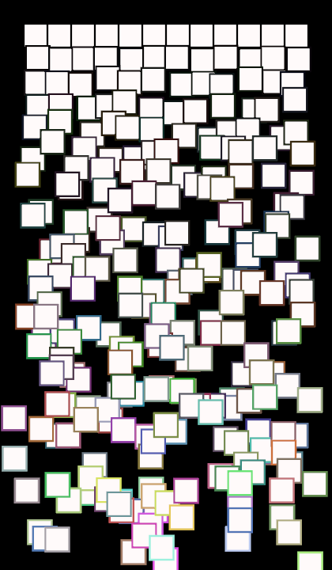

# Schotter 

Implemention done using Rust and Nannou crate.

Followed this fantastic tutorial made by [sidwellr](https://github.com/sidwellr/schotter)
It explains how to recreate Schotter, a famous artwork by computer art pioneer Georg Nees.

A few additional features have been added that are not in the tutorial.

If you would like to try playing with this, you will need to:
* [Install Rust](https://www.rust-lang.org/learn/get-started)
* Pull the repository
* In the terminal `cargo run`

